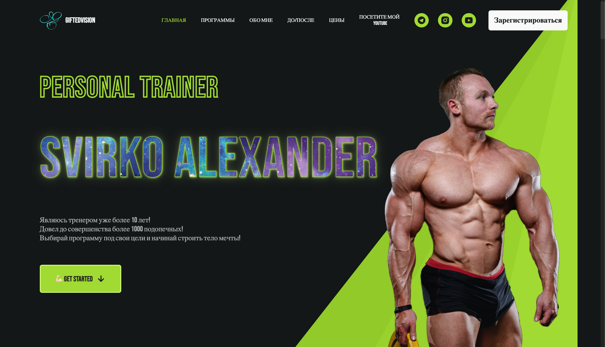
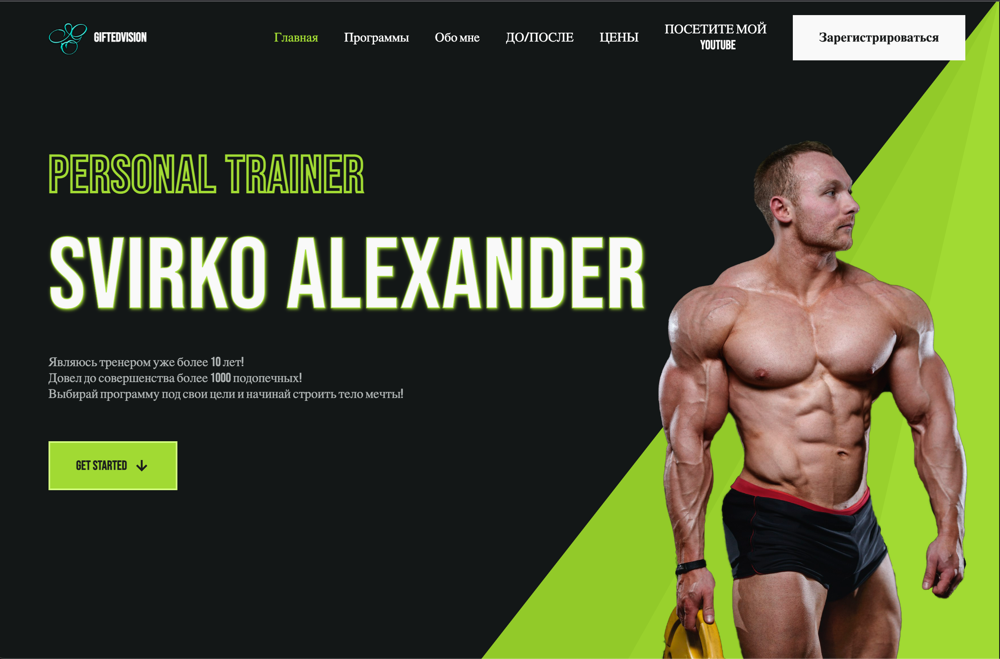
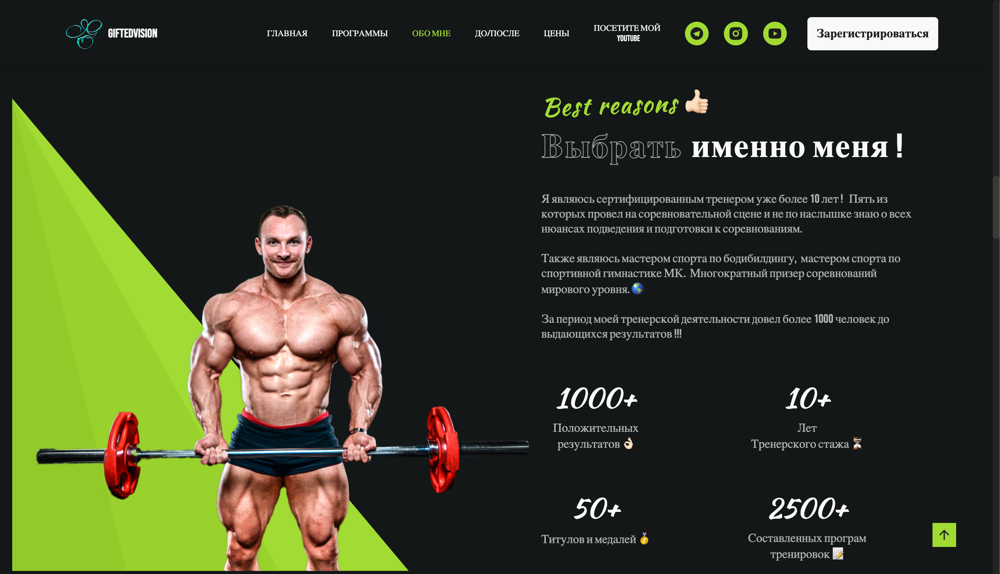
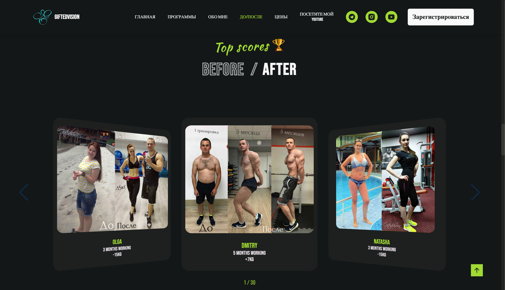
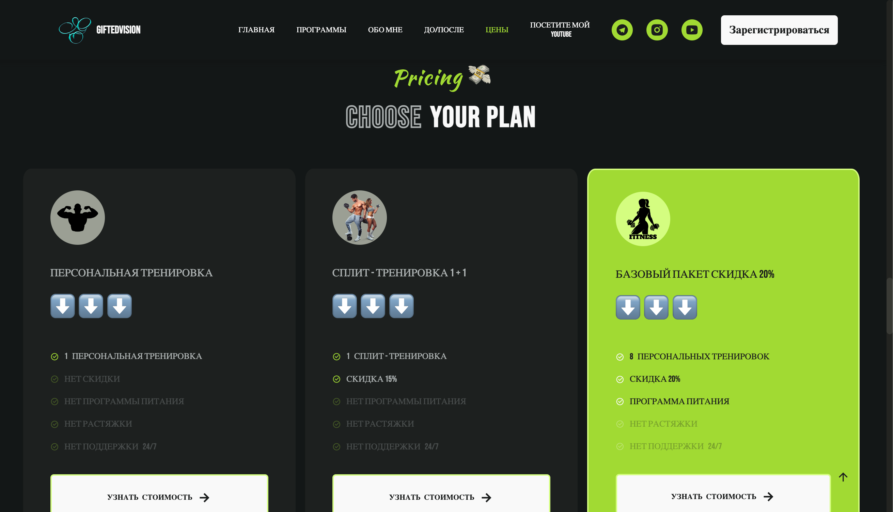
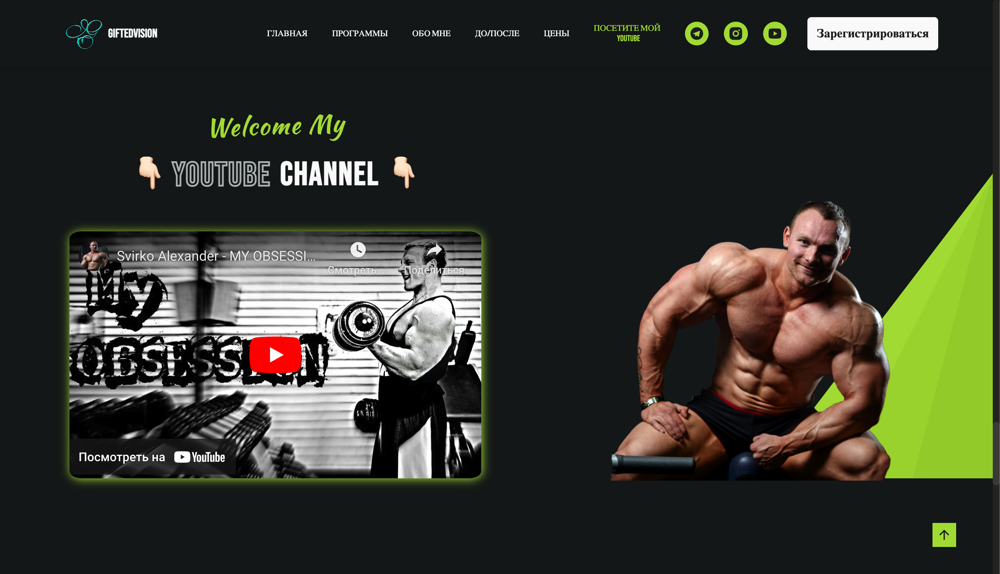
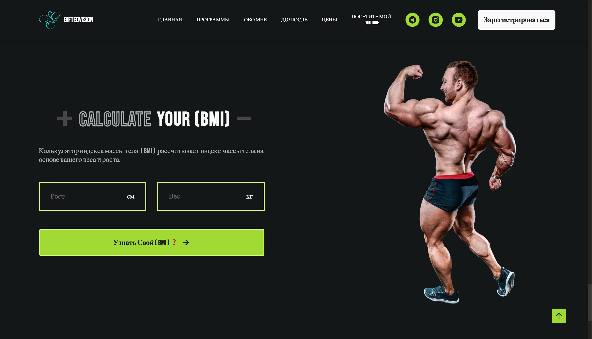

## Main Theme

      

      

      

      

      

      

      

      

## Other Devices 📱

      
      

   
   
   

## Описание

Создание и разработка полноценного сайта для Фитнес тренера. Использование современных технологий веб-разработки. Смотрите другие мои работы!

## Description

Creation and development of a full-fledged site for an fitness trainer. Using modern web development technologies. See my other works!

## Просмотр проекта 👇🏻

- 👀 [
Посмотреть Сайт](https://giftedvision.netlify.app/)

## Developer

- 💻 [Svirko Alexander](https://github.com/SvirkoAlexander)

## License

Project https://giftedvision.netlify.app/ is distributed under the MIT License.
